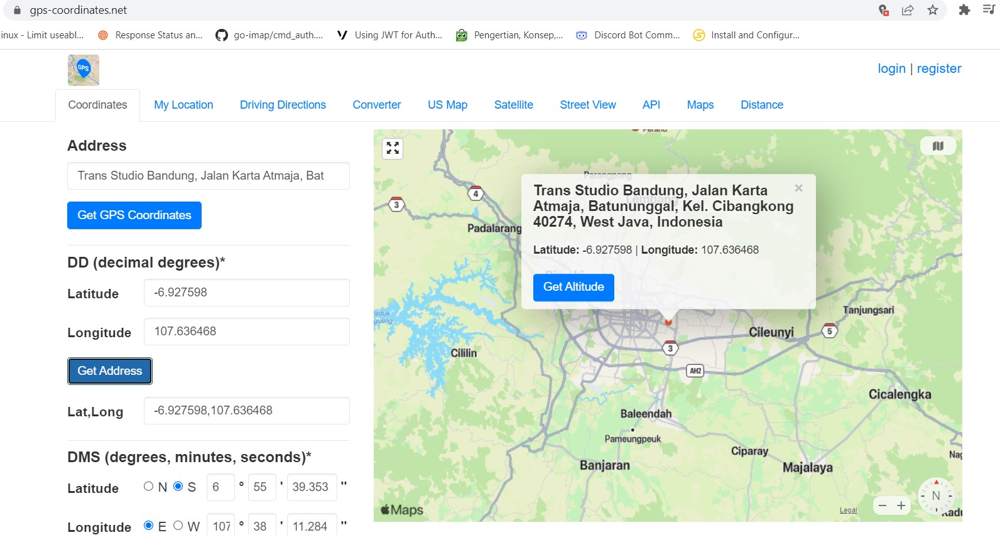
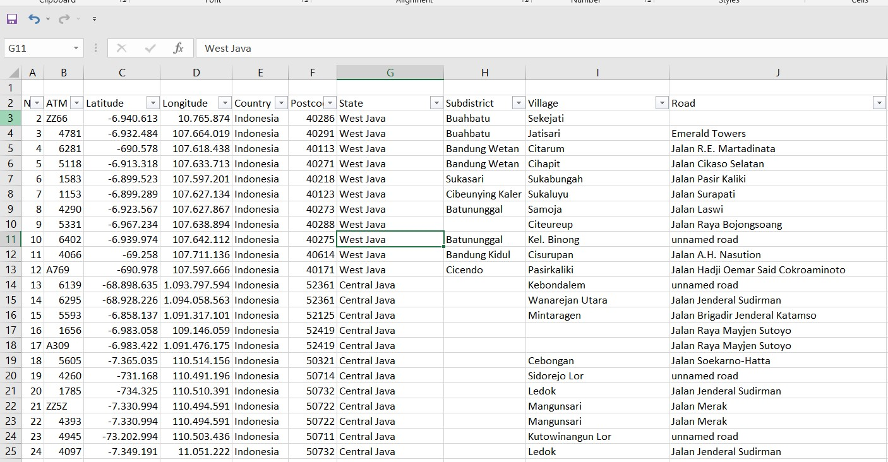

# Check Valid Geolocation With Latitudes and Longitudes




## Description
This is a simple project to check the  validity of geolocation with latitude and longitude.

Features:
* Check Valid Geolocation With Latitudes and Longitudes
* Input datasource using csv file contains latitude & longitude.
* Output format csv file contains country, postcode, state and road with valid geolocation.
* Use API From [gps-coordinates.net](https://www.gps-coordinates.net/)
* Suitable for cleaning geolocation data.


### How To Run This Tools
> Make sure you have prepared the datasource.csv file according to the existing format


Since the project already use Go Module, I recommend to put the source code in any folder but GOPATH.

If Error API KEY please change the API KEY in the file `config.json`

you can get API key from [gps-coordinates.net](https://www.gps-coordinates.net/)


#### Commad Line

  ```sh
  $ go get . || go mod 
  ```

  - Start application

  ```sh
  $ go run main.go  
  ```
  - Build application Windows

  ```sh
  $ set GOOS=windows
  $ go build -o geolocation-win.exe main.go 
  ```

  - Build application Linux

  ```sh
  $ set GOOS=linux
  $ go build -o geolocation-linux main.go 
  ```

  - Build application Mac

  ```sh
  $ set GOOS=darwin
  $ go build -o geolocation-mac main.go 
  ```


